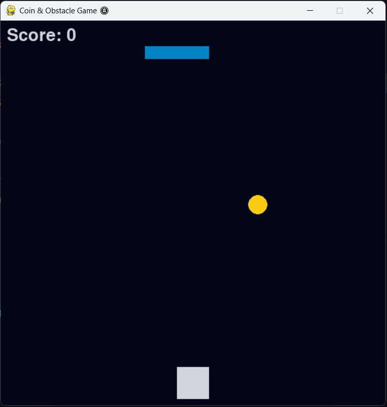

# 🪙 CoinRush - A Simple Pygame Challenge


---

🎮 **CoinRush** is a fast-paced arcade-style game where you dodge obstacles and collect falling coins to increase your score.  
Built with Python and Pygame.

---

## 📸 Preview



---

## 🚀 Features

- Smooth left/right movement
- Increasing difficulty over time
- Coin collection with score tracking
- Game over & restart functionality
- Dark mode visual style

---

## 🎮 Controls

- ⬅️ `Left Arrow`: Move left  
- ➡️ `Right Arrow`: Move right  
- ↩️ `Enter`: Restart the game after Game Over  

---

## 🛠️ Setup

```bash
# 1. Clone the repository
git clone https://github.com/parsa-vesali/CoinRush-.git

# 2. Navigate to the project directory
cd CoinRush-

# 3. (Optional) Create virtual environment
python -m venv .venv
source .venv/bin/activate  # or .venv\Scripts\activate on Windows

# 4. Install dependencies
pip install pygame
